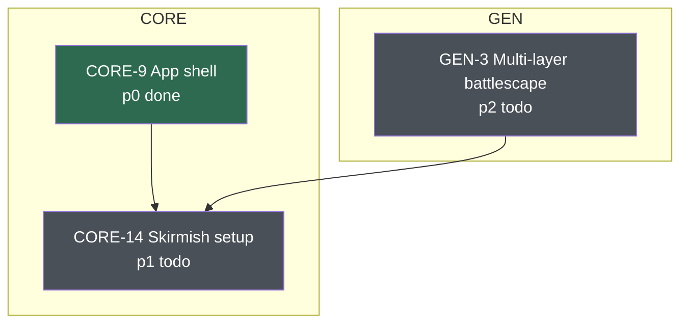

# Docket: Scope of Work

This is the starting document for anyone implementing `docket`.
It records what `docket` is, every design decision already made, the reasoning behind each one, and the alternatives that were considered and rejected.
If a question feels open while reading this, check the Decisions section before raising it, because most of them have already been settled.

## What docket is

A per-repo ticketing system that is simultaneously a plain-markdown collection a human can read in a text editor and a structured store a Claude Code agent can query through MCP.

It is developed and versioned in its own repository, then deployed into any number of consumer repositories with a single command.
The consumer repository receives only data and configuration, never a copy of the tool.

## Origin

The design is a generalization of a hand-rolled ticket system that grew inside a real work repository.
That system is markdown files split across `docs/tickets/todo/` and `docs/tickets/done/`, each named `P29_skirmishSetup.md`, each opening with an H1 carrying the id, title, and a backticked status, followed by a blockquote listing pre-requisites and blocked tickets as markdown links, followed by prose.

Everything that worked there is preserved.
Three things did not work and are fixed here:

1. Dependency edges were stored on both sides, as a `Pre-Requisites` list and a `Blocking` list. The repo's own README called a one-sided edge "a bug in the graph", which is an admission that storing both sides guarantees the bug eventually.
2. Status lived in the H1 text and in the directory name at the same time, with nothing keeping them in sync.
3. The `P` prefix meant "phase". Nothing ever read it. It sorted and namespaced and that was all.

## Non-goals

- Not a replacement for GitHub Issues, Jira, or any hosted tracker. There is no sync, no API client, no webhooks.
- Not multi-user. There is no assignment, no comments, no notifications, no concurrency control beyond what git already provides.
- Not a workflow engine. Statuses are a small fixed vocabulary, not a configurable state machine.
- Not speculative. Build what is specified here. Do not add fields, statuses, or tools because they might be useful.

## Decisions

Each of these was discussed and settled.
The rationale is recorded because an implementer who does not know why a decision was made will eventually undo it.

### Dependency edges are stored one way only

A ticket declares `requires`, listing the ids it depends on.
It never declares what it blocks.

Reverse edges are derived by scanning the `requires` field of every ticket in the set.
The scan is trivially cheap at any plausible ticket count.

This makes a one-sided edge impossible by construction rather than merely detectable.

Rejected: storing both directions, which is what the source repo did. It reads fully from a single raw file with no derivation, at the cost of a permanent class of silent inconsistency.

### Frontmatter is the only machine-readable surface

Structured fields live in a YAML frontmatter block.
The markdown body below it is prose owned entirely by the human or agent writing the ticket, and no tool parses it.

Rejected: a tool-regenerated blockquote of markdown links below the H1, which would have preserved the clickable navigation of the source repo. It was declined because it creates a second representation of the same data that must be kept in sync.

Rejected: a generated `INDEX.md` listing every ticket. Explicitly not wanted. Navigation happens through the CLI and MCP, not through a checked-in generated file.

### Ids are `<KEY>-<NUM>`

For example `CORE-14`.
The key groups related work, so initial-setup tickets and map-generation tickets carry different keys.
Numbering is sequential per key, starting at 1.

The next number for a key is derived by scanning existing ids at creation time.
There is no counter file, because a counter file is a second source of truth that desynchronizes.

Rejected: a global sequential counter with a configurable prefix, which is what the source repo had. Keying is strictly better since two branches working different areas mint into different counters and cannot collide.

Rejected: random-suffixed and ULID-style ids. Collision-proof but they lose the small readable integer that makes ids usable in conversation and in prose cross-references.

Branch collision is still possible when two branches add tickets under the same key.
This is accepted. `validate` detects duplicate ids at merge time and reports them.

### The key registry is closed, with an agent-accessible proposal path

Keys must be declared in configuration before tickets can use them.
An unregistered key is rejected on ticket creation, so a typo cannot silently spawn an orphan group.

An agent frequently needs a new key mid-task, for example when a new project is proposed and a batch of tickets is being written for it.
Blocking hard at that moment strands the agent halfway through a batch, and the recovery is a human hand-editing TOML.

So the gate is soft:

- The MCP tool `propose_key` writes the key into a proposed section of the configuration along with a description and a rationale.
- Tickets may be created under a proposed key immediately, so the batch completes.
- `validate` reports every proposed key as a warning until a human promotes it.
- A human promotes with `docket key approve <KEY>` or removes it with `docket key reject <KEY>`.

The typo case still dies, because the agent must consciously call `propose_key`, and that call lands in the configuration file where it shows up in the git diff.

### Status lives in frontmatter, and the directory follows it

The vocabulary is `todo`, `wip`, `done`.
Only `done` moves the file, into `done/`. Both `todo` and `wip` live in `todo/`, matching how the source repo used the two directories.

The status field is the truth and the directory is a projection of it, maintained by the tool.
No operation writes one without the other.
`validate` catches drift for the case where a human moved a file by hand.

### The H1 no longer carries the id or status

The source repo wrote `# P29 Skirmish setup \`TODO\``.
Docket writes `# Skirmish setup`.

Frontmatter owns id and status, so duplicating them in the heading is a second place to drift.
The tradeoff is accepted: a raw file no longer shows its status in the heading, though its directory still indicates whether it is done.

### Filenames are frozen at creation

The filename slug derives from the title once, at creation.
Retitling a ticket does not rename its file.

Renaming would break every prose cross-reference in every other ticket.

### Priority is an integer, ascending urgency

`priority: 0` is most urgent.
The default on creation is `2`, so untriaged work lands in a real bucket rather than defaulting to maximum urgency.
The ceiling is configurable and enforced by `validate`.

Listing sorts by `(priority, id)`.

### Unknown frontmatter keys are preserved

A consumer repository may add its own fields, for example `tags` or `owner`.
Parsing must round-trip anything it does not recognize, so an unrecognized key survives a rewrite untouched.

This lets a repo extend the schema without a tool change.

### Graph output is mermaid text, not HTML

The MCP tool returns the mermaid source as a string, which the agent reads and reasons about directly.
GitHub, VS Code, and most editors render mermaid natively, so the human case is covered without shipping a renderer.

An HTML page was rejected for v1 for the decisive reason that it is opaque to the agent.
Building a graph feature Claude Code cannot consume would defeat the point.
HTML remains a plausible later `--format html` flag layered over the same graph builder, and the builder should be written so that stays cheap.

### Both a CLI and an MCP server, over one shared core

All logic lives in a core library.
The CLI and the MCP server are thin shells over it and contain no rules of their own.

The MCP server alone would put Claude Code in the loop for every operation, leaving no path for CI validation, no pre-commit hook, and no way for a human to work tickets without an agent running.
The CLI costs little once the core exists.

### Deployment is a global tool install plus per-repo configuration

Install once per machine:

```
uv tool install git+https://github.com/<owner>/docket
```

Then, inside a consumer repository:

```
docket deploy .
```

The consumer repository receives ticket directories, a `CLAUDE.md`, and a configuration file.
It never receives the tool's source.

Rejected: `uvx` on demand, which avoids the install step at the cost of a cold-start resolve and a network dependency on first run.

Rejected: vendoring the tool into each consumer repository, which is hermetic but means the tool's own source appears in every consumer's diffs and upgrades become a manual copy per repository.

### Tickets are mutable through the tool, not by hand

The deployed `CLAUDE.md` tells an agent never to hand-edit ticket files, so the tool must supply a path for every field an agent legitimately needs to change.
`title`, `priority`, and `requires` all change over a ticket's life as work is retriaged and dependencies are discovered.

`docket set` and the MCP tool `update_ticket` cover exactly those three fields.
`status` is deliberately excluded, because changing it moves the file and that already belongs to `docket status` and `set_status`.
The filename is excluded because filenames are frozen at creation.

This is an addition to the surface originally specified here, made because the original surface was write-once and contradicted its own instruction against hand-editing.
It is not an invitation to keep growing the surface. Nothing beyond these three fields is mutable through the tool.

### The status vocabulary is fixed in the tool

`todo`, `wip`, and `done`, hardcoded.

An earlier draft of the configuration carried a `statuses` list, which contradicted this document's own non-goal of not being a workflow engine.
It also could not survive contact with the directory projection rule, since `done` is the only status that moves a file and a configurable list cannot express that without becoming a state machine.
The key is gone from the configuration entirely rather than being read and ignored.

`doneDir` and `todoDir` remain configurable, since those are path choices rather than vocabulary.

### Resolved implementation decisions

These were open after the first read of this document and are now settled.

- Configuration is found by walking up from the current directory and stopping at the git root. A parent repository's `.docket.toml` is never picked up. Failure to find one reports the directories searched.
- A `requires` entry naming an id that does not exist yet is a warning at creation time, not a hard error, so an agent writing a batch out of order is never stranded mid-batch. It remains an error in `validate`, which is expected to run after every batch.
- `deploy` is idempotent. It creates missing directories, writes `CLAUDE.md`, and merges `.mcp.json`, but never rewrites an existing `.docket.toml`, because that file holds the key registry.
- Every MCP tool returns a JSON object encoded as text, including `graph`, where the mermaid source is a string field rather than the whole payload. Structured output is unambiguous for the model and testable.
- A created ticket's body is `# <title>`, a blank line, then the supplied body verbatim. If the supplied body already opens with an H1, it is used as-is and no second heading is added.
- This repository does not deploy docket into itself. Docket's own development is tracked with ordinary commits, and `deploy` is verified against a scratch repository instead.

### Presentation is `rich`, and only in the CLI

`rich` and `rich-argparse` give the CLI readable tables, help, and error output for very little code.

The boundary is hard:

- `core/` still never prints. Unchanged.
- `server.py` must never import `rich` and must never write to stdout at all. MCP stdio owns stdout, and a single stray escape sequence corrupts the protocol. Server diagnostics go to stderr.
- Machine-readable CLI output, meaning mermaid source to stdout or to `--out`, bypasses `rich` and goes through a plain writer, so no wrapping, highlighting, or ANSI escapes leak into a pipe.

`rich` already suppresses color on a non-tty and honors `NO_COLOR`, so no extra flag is needed.

## Ticket format

```markdown
---
id: CORE-14
title: Skirmish setup
status: todo
priority: 1
requires: [CORE-9, GEN-3]
---

# Skirmish setup

Goal: a screen where the player sets up one battle and plays it.

Prose continues here, unparsed and unconstrained.
```

Field reference:

| Field | Type | Required | Notes |
|---|---|---|---|
| `id` | string | yes | `<KEY>-<NUM>`. Must match the filename prefix. |
| `title` | string | yes | Free text. May change without renaming the file. |
| `status` | enum | yes | `todo`, `wip`, or `done`. The vocabulary is fixed in the tool, not configurable. |
| `priority` | int | yes | `0` most urgent. Defaults to config `defaultPriority` on creation. |
| `requires` | list of id | yes | May be empty. Never lists what this ticket blocks. |

Anything else present is preserved verbatim on rewrite.

Filename: `CORE-14_skirmishSetup.md`.
The id, then an underscore, then a camelCase slug derived from the title.
The camelCase slug matches the convention the source repo used and this repo's own code style.

### Slug generation

A title is free text supplied by a human or an agent, so it cannot be trusted as a filename fragment.
`slugify` in `ids.py` is a pure function and the only thing permitted to produce a slug.

1. Normalize the title with Unicode NFKD, strip combining marks, and drop any non-ASCII character that survives.
2. Split on every run of characters outside `[A-Za-z0-9]`. This is an allowlist, so path separators, `..`, quotes, null bytes, and control characters are discarded as a consequence of the rule rather than by an explicit blocklist that can be outgrown.
3. Lowercase the first token entirely. For every later token, uppercase the first character and lowercase the rest, so `HTTP API client` becomes `httpApiClient`.
4. Truncate to 48 characters, at a token boundary when one is available and with a hard cut otherwise.
5. If nothing survives, because the title was entirely emoji, CJK, or punctuation, fall back to `untitled`.

Windows reserved device names need no special handling, since the filename is always `<ID>_<slug>.md` and the id prefix means the stem can never equal `CON` or `NUL`.
Case-insensitive filename collisions need no special handling either, because the id prefix is already unique.
The function must be tested against a table of hostile inputs, not only well-formed titles.

Serialization notes for the implementer:

- Field order is explicit, not incidental. Build the mapping in the canonical order given in the table above, `id`, `title`, `status`, `priority`, `requires`, then append any preserved unknown fields in the order they were read.
- Dump with `sort_keys=False`. `pyyaml` follows dict insertion order when sorting is disabled, so an explicitly ordered mapping is the whole mechanism. Leaving sorting on alphabetizes the fields, which churns field order on every write and makes every touched ticket show a spurious diff.
- Write `requires` in flow style (`[CORE-9, GEN-3]`) so a ticket with no dependencies reads as `requires: []` on one line.
- `pyyaml` does not preserve comments, so a comment written inside a frontmatter block is lost on rewrite. This is accepted, since frontmatter is machine-owned and prose belongs in the body. If that turns out to bite, `ruamel.yaml` in round-trip mode preserves both comments and order and is a drop-in replacement for this narrow use.

## Configuration

Written to the consumer repository as `.docket.toml` at its root.

```toml
root = "docs/tickets"
doneDir = "done"
todoDir = "todo"
defaultPriority = 2
maxPriority = 4

[keys]
CORE = "tactical-sim core"
HEAD = "Godot frontend and seam"
GEN  = "map generation"

[keys.proposed]
META = { description = "campaign and progression", rationale = "the strategic layer is a distinct area", by = "agent", at = "2026-07-27" }
```

Promoting and rejecting proposed keys means the tool writes this file, not only reads it.
`tomllib` from the standard library is read-only, so a writer is needed regardless.

Use `tomlkit` for both reading and writing, and do not use `tomllib` at all.
`tomlkit` round-trips comments, spacing, and key order, which matters here because this file is hand-maintained: a user will comment around their key descriptions to explain what each group covers.
A write-only serializer such as `tomli-w` reconstructs the file from a plain dict, so every agent call to `propose_key` would silently strip every comment the user wrote.
Hand-rolling a writer is worse still, since hand-rolled TOML writers accumulate escaping bugs.

## Repository layout

```
src/docket/
  core/
    ticket.py     Ticket dataclass, parse, serialize
    ids.py        key parsing, next-number allocation, slug generation
    store.py      discovery, load-all, write, status moves
    config.py     read and write .docket.toml, key registry
    graph.py      forward and reverse edge resolution, traversal
    mermaid.py    render a resolved graph to mermaid source
    validate.py   all integrity rules
  cli.py          argument parsing and command dispatch
  server.py       MCP stdio server
  templates/
    CLAUDE.md     deployed into consumer repos
    docket.toml   deployed as .docket.toml
tests/
docs/
  scopeOfWork.md  this document
```

Dependencies: the `mcp` Python SDK, `pyyaml` for frontmatter, `tomlkit` for configuration, and `rich` with `rich-argparse` for CLI presentation.
Testing uses `pytest`.
No JavaScript, no TypeScript, no npm, and no Rust bindings.

## Core library responsibilities

The core is the only place that knows the rules.
It exposes functions that both shells call, and it never prints, never reads `argv`, and never touches stdio.

- Parse a ticket file into a structured object, preserving unknown frontmatter keys and the body verbatim.
- Serialize that object back to a file with stable field ordering.
- Discover every ticket under the configured root, across both status directories.
- Allocate the next id for a given key by scanning existing ids.
- Generate a filename slug from a title.
- Change a ticket's status, performing the directory move as part of the same operation.
- Change a ticket's `title`, `priority`, and `requires` in place, leaving the filename and the body untouched.
- Resolve the dependency graph, producing reverse edges by scanning forward ones.
- Traverse the graph from a ticket or across a key.
- Render a resolved graph as mermaid source.
- Read and write configuration, including proposing, approving, and rejecting keys.
- Run every validation rule and return structured findings.

## Validation rules

`validate` returns findings, and must distinguish errors from warnings.

Errors:

- A `requires` entry naming an id that does not exist.
- A cycle in the dependency graph.
- Two tickets sharing an id.
- A ticket whose key is neither registered nor proposed.
- A ticket whose `id` does not match its filename prefix.
- A ticket whose `status` does not agree with the directory it sits in.
- A `priority` outside `0` through `maxPriority`.
- A `status` outside `todo`, `wip`, `done`.

Warnings:

- A key that is proposed but not yet approved.
- A proposed key with no tickets using it.

`validate` is what makes the system trustworthy under a pre-commit hook or in CI, so it should be fast enough to run on every commit.

## CLI surface

```
docket new --key CORE --title "Skirmish setup" [--requires CORE-9,GEN-3] [--priority 1]
docket show CORE-14
docket list [--status todo] [--key CORE] [--priority-max 2]
docket set CORE-14 [--title "New title"] [--priority 0] [--requires CORE-9,GEN-3]
docket status CORE-14 done
docket graph [--id CORE-14 | --key GEN] [--out FILE]
docket key list [--proposed]
docket key approve META
docket key reject META
docket validate
docket deploy PATH
docket upgrade PATH
```

Notes:

- `show` prints the body along with resolved dependency context, not the raw file. Use `cat` for the raw file.
- `set` changes `title`, `priority`, and `requires` only. It never changes `status`, which belongs to `docket status`, and it never renames the file, since filenames are frozen at creation.
- `graph` writes mermaid source to stdout by default, or to a file with `--out`.
- `key reject` must fail loudly if tickets already use the key, and name them.
- `upgrade` rewrites the deployed templates in a consumer repository without touching its tickets or its key registry.

## MCP surface

A stdio server, built on the `mcp` Python SDK.

| Tool | Purpose |
|---|---|
| `list_tickets(status?, key?, priority_max?)` | Summaries only. Id, title, status, priority, key. Never full bodies. |
| `read_ticket(id)` | Full body plus resolved dependency context. |
| `create_ticket(key, title, body, requires?, priority?)` | Allocates the id, writes the file, returns the new id. |
| `update_ticket(id, title?, priority?, requires?)` | Changes only these three fields. Never status, never the filename. |
| `set_status(id, status)` | Updates frontmatter and performs the directory move together. |
| `graph(id?, key?)` | Returns mermaid source as a string. |
| `list_keys()` | Registered and proposed keys with their descriptions. |
| `propose_key(key, description, rationale)` | Adds to the proposed section. |
| `validate()` | Structured findings. |

Design requirements for the server:

- `read_ticket` must inject resolved dependency context that the raw file does not contain: for each entry in `requires`, and for each ticket that requires this one, return the id along with its title and status. This is why the raw file can afford to carry bare ids.
- `list_tickets` must never return full bodies. An agent listing forty tickets should not pay for forty bodies.
- Tool descriptions must state the valid key list, or direct the agent to `list_keys` first, so `create_ticket` is not called with a guessed key.
- `create_ticket` rejects a key that is neither registered nor proposed, and its error message must point at `propose_key`.

### Naming across the two surfaces

The rule is stated in `CLAUDE.md` under Naming across interfaces and is repeated here because it is the one place a shell touches both conventions at once.

This repository's code style is camelCase for Python functions, variables, and parameters.
MCP tool names and their parameters are an external interface and follow the MCP ecosystem's snake_case convention, exactly as written in the table above, because that is what the model sees.
Frontmatter keys are lowercase data keys, as written in the format section.
TOML configuration keys are camelCase, matching the repository style.

Keep the mapping between the snake_case MCP surface and the camelCase core explicit in `server.py`.
Do not let either convention leak into the other.

## Graph and mermaid rendering

Two scopes:

- `graph(id)` renders the transitive ancestors and descendants of one ticket.
- `graph(key)` renders every ticket carrying that key, plus its immediate cross-key neighbors, marked so the boundary is visible.

Output shape:



Rules:

- One `subgraph` per key.
- One `classDef` per status.
- Priority appears in the node label, not in the styling, so it survives in a renderer that ignores classes.
- Node identifiers must be sanitized. Mermaid dislikes hyphens in identifiers, so `CORE-14` becomes `CORE_14`. The hyphenated id stays in the label.
- The edge direction is dependency to dependent, so an arrow reads as "must happen before".

Keep the traversal and the rendering in separate modules.
The traversal produces a resolved structure, and mermaid is one renderer over it.
That is what keeps a later HTML renderer cheap.

## Deployment

`docket deploy PATH` performs four steps:

1. Create `<root>/todo/` and `<root>/done/`.
2. Write `<root>/CLAUDE.md` from the template.
3. Write `.docket.toml` at the repository root, with an empty key registry the user then populates.
4. Merge a server entry into the repository's `.mcp.json`, creating the file if absent.

The `.mcp.json` merge is the step most likely to cause damage, so it must read, modify, and write rather than overwrite.
An existing `docket` entry is replaced. Every other entry is preserved byte-for-byte where possible.

The consumer repository ends up with only ticket data, a `CLAUDE.md`, a `.docket.toml`, and one line of `.mcp.json`.

### The deployed CLAUDE.md

This template is the single most important deliverable for agent behavior, because it is what an agent reads when it opens the ticket directory in a repository that has never seen docket before.

It must be written to be understood with no other context and must cover:

- That tickets are markdown with YAML frontmatter, and what every field means.
- That the agent should use the docket MCP tools rather than hand-editing files, and specifically that it must never move a file between `todo/` and `done/` by hand.
- That `requires` is the only direction stored, and reverse edges come back from `read_ticket`.
- That keys are closed, that `list_keys` shows the valid ones, and that `propose_key` is the path to a new one.
- The instruction carried over from the source repository, which is load-bearing: write tickets so that any discussed architecture, assumptions, and questions already answered are included in the ticket in a way that is apparent to a new reader.

Keep it short and blunt. It is instruction, not documentation.

A `README.md` in the ticket directory is explicitly not required and not enforced.
The source repository's README carried project-specific context and locked decisions, which is valuable but cannot be generalized.
A consumer repository may write one, and docket ignores it.

## Build order

1. `core/` first, with tests. Parse, serialize, ids, store, config. Nothing else can be written before this is right.
2. `graph.py` and `mermaid.py`.
3. `validate.py`, which depends on everything above.
4. `cli.py`, a thin shell.
5. `server.py`, a thin shell.
6. `deploy` and the templates.
7. Packaging: entry points for `docket` and `docket-mcp`, and verification that `uv tool install` from a git URL produces working binaries.

Each stage should compile and pass its own tests before the next begins.

## Estimate

| Piece | Approximate LOC | Time |
|---|---|---|
| core library | 550 to 700 | 2 to 2.5 days |
| mermaid renderer | 120 | 0.5 day |
| key registry and proposal flow | 120 | 0.3 day |
| CLI | 240 | 0.5 day |
| MCP server | 230 | 0.5 to 1 day |
| deploy, templates, `.mcp.json` merge | 200 | 0.5 to 1 day |
| tests and uv packaging | 350 | 1 day |
| documentation | n/a | 0.5 day |

Total: roughly 1800 to 2100 lines, around 5.8 focused days of human work.

## Out of scope for this repository

Migrating the `Sorcerio/Defilade-Engine` ticket collection onto docket is a separate effort, handled after docket is built, and it is not a factor in docket's development.
It is mentioned here only so an implementer understands why the design mirrors that repository's conventions so closely.

That migration will need a mapping from the existing `P0` through `P36` ids onto keys, which is a judgment call about that project's structure rather than a mechanical transform, plus a rewrite of every cross-reference in every ticket body.
Do not build a general migration importer for it.
