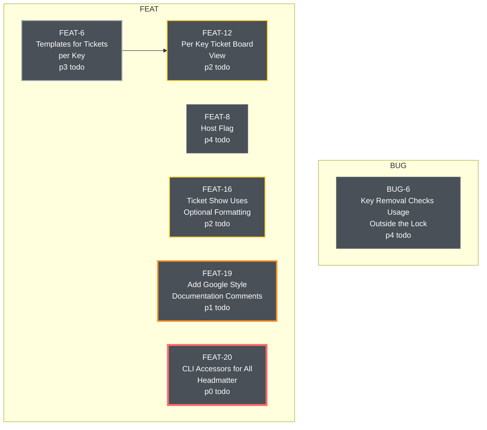

# Roadmap: todo

> Generated with `docket docs roadmap`.

## Legend

| Shape | Status |
|---|---|
| `[ ]` | todo, not started |
| `{ }` | wip, in flight |
| `( )` | done |

Arrows indicate required order of operations.

Each node's border represents its priority. Heaviest is higher priority.
